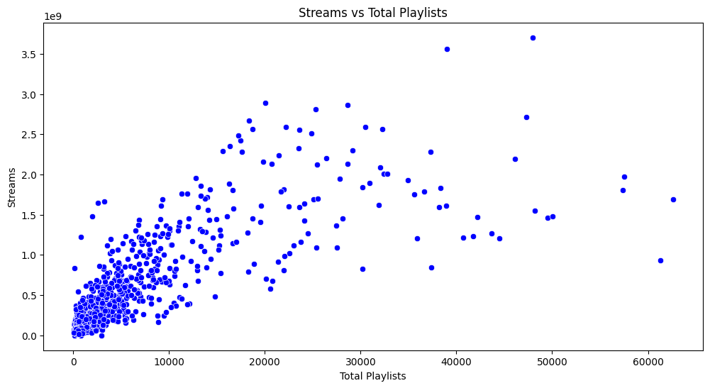
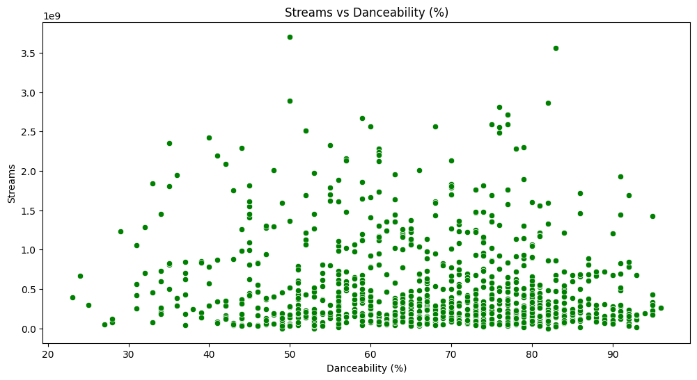
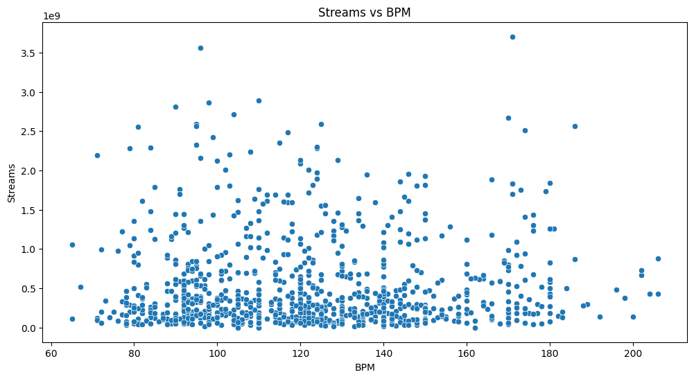
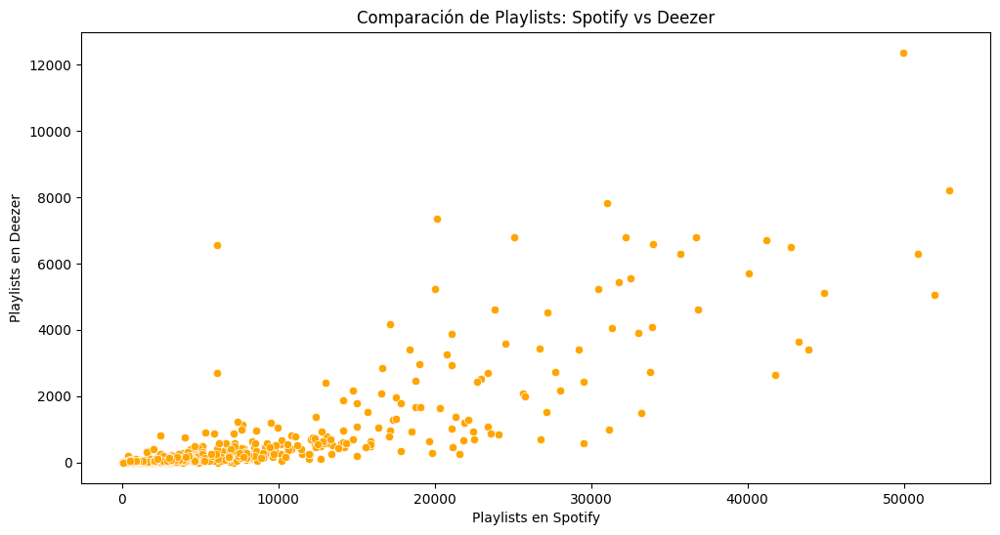
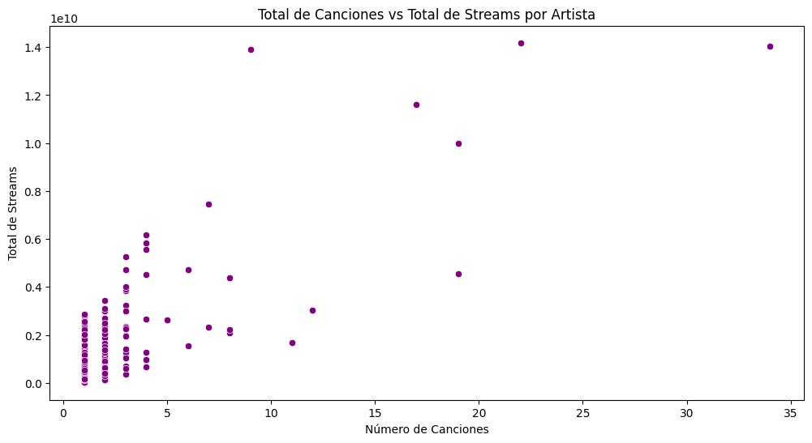

# **Análisis musical**

Preguntas a responder:

- [¿Las canciones con mayor BPM (beats por minuto) tienen más reproducciones en Spotify?](#correlación-entre-bpm-y-streams-streams-es-de-spotify)
- [¿Las canciones más populares en Spotify también lo son en otras plataformas como Deezer?](#correlación-entre-playlists-de-spotify-y-deezer)
- [¿Estar en más listas de reproducción se relaciona con mayor cantidad de reproducciones?](#correlación-entre-streams-y-playlists)
- [¿Los artistas con más canciones disponibles tienen más reproducciones?](#correlación-entre-número-de-canciones-por-artista-y-total-de-reproducciones)
- [¿Las características técnicas de una canción influyen en su número de reproducciones?](#correlación-entre-streams-y-bailabilidad)

# Competition

### 🔹 Glosario de columnas - tabla `competition`

- **track_id** → Identificador único de la canción en Spotify. Permite referenciar la canción de manera inequívoca.
- **in_apple_playlists** → Número de listas de reproducción de Apple Music en las que aparece la canción. Indica difusión o exposición de la canción.
- **in_apple_charts** → Número de charts o rankings de Apple Music donde aparece la canción. Refleja popularidad relativa en Apple.
- **in_deezer_playlists** → Número de listas de reproducción de Deezer en las que aparece la canción.
- **in_deezer_charts** → Número de charts o rankings de Deezer donde aparece la canción.
- **in_shazam_charts** → Número de charts de Shazam donde aparece la canción. Los valores `NULL` representan información desconocida.

## Revisión de valores nulos en **competition**

```
SELECT track_id FROM `laboratoria-470421.data_music.competition`
WHERE track_id IS NULL ; // No hubo registros

SELECT in_apple_playlists FROM `laboratoria-470421.data_music.competition`
WHERE in_apple_playlists IS NULL ;  // No hubo registros

SELECT in_apple_charts FROM `laboratoria-470421.data_music.competition`
WHERE in_apple_charts IS NULL ; // No hubo registros

SELECT in_deezer_playlists FROM `laboratoria-470421.data_music.competition`
WHERE in_deezer_playlists IS NULL ; // No hubo registros

SELECT in_deezer_charts FROM `laboratoria-470421.data_music.competition`
WHERE in_deezer_charts IS NULL ; // No hubo registros

SELECT in_shazam_charts FROM `laboratoria-470421.data_music.competition`
WHERE in_shazam_charts IS NULL ; // 50 registros con NULL

SELECT count(*) FROM `laboratoria-470421.data_music.competition` ; // 953

```

### ✅ Resumen de nulos en la tabla `competition`

| Columna               | Nulos detectados | Observaciones                                                                    |
| --------------------- | ---------------- | -------------------------------------------------------------------------------- |
| `track_id`            | 0                | Todos los registros tienen identificador.                                        |
| `in_apple_playlists`  | 0                | Todos los registros tienen información de playlists de Apple.                    |
| `in_apple_charts`     | 0                | No hay valores faltantes.                                                        |
| `in_deezer_playlists` | 0                | No hay valores faltantes.                                                        |
| `in_deezer_charts`    | 0                | No hay valores faltantes.                                                        |
| `in_shazam_charts`    | 50               | 50 registros con `NULL`, representa información desconocida sobre Shazam Charts. |
| **Total registros**   | 953              | Cantidad total de canciones en la tabla.                                         |

**Observaciones importantes:**

- Todas las columnas de Apple y Deezer están completas.
- Solo `in_shazam_charts` tiene nulos, que se interpretan como “desconocido” en el análisis.
- Mantener los nulos en `in_shazam_charts` permite diferenciar entre canciones que **no aparecieron** (`0`) y canciones con **información faltante** (`NULL`).
- Dejar consultas separadas está bien para documentación o seguimiento histórico; más adelante se pueden combinar en un solo query con `COUNTIF`.

Otra manera de observar cuántos datos tienen valor, cuántos son 0 y cuántos NULL:

```
SELECT
  COUNTIF(in_shazam_charts > 0) AS en_shazam,
  COUNTIF(in_shazam_charts = 0) AS no_en_shazam,
  COUNTIF(in_shazam_charts IS NULL) AS nulos
FROM `laboratoria-470421.data_music.competition`

// La salida: 559 valores diferentes a 0, 344 iguales a cero y 50 nulos;
```

Para trabajar con esos valores más adelante con Looker studio, se decidió imputar esos valores NULL con -1, para así diferenciar de los 0. Y se puede crear otra tabla con esta consulta:

```
CREATE OR REPLACE TABLE data_music.competition_clean AS
SELECT
  track_id,
  in_apple_playlists,
  in_apple_charts,
  in_deezer_playlists,
  in_deezer_charts,
  IFNULL(in_shazam_charts, -1) AS in_shazam_charts
FROM `laboratoria-470421.data_music.competition`;
```

# Spotify

### 🔹 Glosario de columnas - tabla `spotify`

- **track_id** → Identificador único de la canción en Spotify. Permite referenciar la canción de manera inequívoca.

- **track_name** → Nombre de la canción. Es útil para mostrar títulos y para unir con otras tablas de información.

- **artists_name** → Nombre(s) del o los artistas que interpretan la canción.

- **artist_count** → Número de artistas asociados a la canción. Por ejemplo, un dueto tendría 2.

- **released_year** → Año de lanzamiento de la canción. Sirve para análisis temporales o de tendencias.

- **released_month** → Mes de lanzamiento (1-12). Permite hacer análisis estacionales o de estacionalidad en reproducciones.

- **released_day** → Día de lanzamiento (1-31). Útil si quieres analizar patrones de lanzamiento exactos.

- **in_spotify_playlists** → Número de listas de reproducción en Spotify donde aparece la canción. Indica difusión o exposición de la canción.

- **in_spotify_charts** → Número de charts o rankings de Spotify donde aparece la canción. Refleja popularidad relativa.

- **streams** → Número total de reproducciones de la canción en Spotify. Es la métrica principal de éxito.

## Revisión de valores nulos en **spotify**

```
SELECT
COUNTIF(track_id IS NULL) AS nulos_id,
COUNTIF(track_name IS NULL) AS nulos_trackname,
COUNTIF(artists_name IS NULL) AS nulos_artistname,
COUNTIF(artist_count IS NULL) AS nulos_artistcount,
COUNTIF(released_year IS NULL) AS nulos_realeasedyear,
COUNTIF(released_month IS NULL) AS nulos_releasedmonth,
COUNTIF(released_day IS NULL) AS nulos_releasedday,
COUNTIF(in_spotify_playlists IS NULL) AS nulos_spotiyplay,
COUNTIF (in_spotify_charts IS NULL) AS nulos_spotycharts,
COUNTIF(streams IS NULL) AS nulos_streams
FROM `laboratoria-470421.data_music.spotify`

// NO hubo valores nulos en ninguna columna wuu
```

# Technical_info

### 🔹 Glosario de columnas - tabla `technical_info` (según Spotify Audio Features)

- **track_id** → Identificador único de la canción.

- **bpm** → Beats Per Minute: indica la velocidad de la canción. Valores altos → canción rápida.

- **key** → La tonalidad de la canción, vemos acordes en forma de letras (A, B,C, C♯/D♭, D, etc). Esto indica la nota base sobre la que está la canción.

- **mode** → Modo musical: 0 = menor, 1 = mayor.

- **danceability\_%** → Qué tan bailable es la canción (0-100%). Spotify calcula esto según ritmo, estabilidad, etc.

- **valence\_%** → Positividad de la canción (0 = triste, 100 = feliz).

- **energy\_%** → Intensidad, fuerza o energía de la canción (0-100%).

- **acousticness\_%** → Qué tan acústica es la canción (0-100%).

- **instrumentalness\_%** → Qué tan instrumental es (0 = con voz, 100 = instrumental puro).

- **liveness\_%** → Probabilidad de que la canción haya sido grabada en vivo (0-100%).

- **speechiness\_%** → Presencia de palabras habladas (0 = poca, 100 = habla pura/rap).

## Revisión de valores nulos en **technical info**

```
SELECT
COUNTIF(track_id IS NULL) AS nulos_id,
COUNTIF(bpm IS NULL) AS nulos_bpm,
COUNTIF(`key` IS NULL) AS nulos_key, // 95 nulos
COUNTIF(mode IS NULL) AS nulos_mode,
COUNTIF(`danceability_%` IS NULL) AS nul_dance,
COUNTIF(`valence_%` IS NULL) AS nulos_valence,
COUNTIF(`energy_%` IS NULL) AS nulos_energy,
COUNTIF(`acousticness_%` IS NULL) AS nulos_acous,
COUNTIF(`instrumentalness_%` IS NULL) AS nulos_instr,
COUNTIF(`liveness_%` IS NULL) AS nulos_liv,
COUNTIF(`speechiness_%` IS NULL) AS nulos_speech,
FROM `laboratoria-470421.data_music.technical_info`
```

Hubo 95 nulos en key (tonalidad de la canción), para cuestiones de visualizaciones se consideró imputar esos valores nulos por "Sin info" con esta consulta que crea una tabla:

```
CREATE OR REPLACE TABLE data_music.technical_info_for_dashboard AS
SELECT
  track_id,
  bpm,
  -- Imputamos "Sin info" donde key es NULL
  IFNULL(key, 'Sin info') AS key,
  mode,
  `danceability_%`,
  `valence_%`,
  `energy_%`,
  `acousticness_%`,
  `instrumentalness_%`,
  `liveness_%`,
  `speechiness_%`
FROM data_music.technical_info;
```

# Identificar duplicados

## En **competition**

```
SELECT
  track_id,
  COUNT(*) AS cantidad
FROM `data_music.competition`
GROUP BY track_id
HAVING COUNT(*) > 1;
// 0 duplicados
```

## En **technical_info**

```
SELECT
  track_id,
  COUNT(*) AS cantidad
FROM `data_music.technical_info`
GROUP BY track_id
HAVING COUNT(*) > 1;
// 0 duplicados
```

## En **spotify**

```
SELECT
  track_id,
  COUNT(*) AS cantidad
FROM `data_music.spotify`
GROUP BY track_id
HAVING COUNT(*) > 1;
// 0 duplicados
```

El check con track_id es suficiente para asegurar que cada canción está registrada una sola vez.

### 🔹 Revisión de duplicados por columna

| Columna                                                                                                                      | Revisión de duplicados necesaria | Observaciones                                                                                                         |
| ---------------------------------------------------------------------------------------------------------------------------- | -------------------------------- | --------------------------------------------------------------------------------------------------------------------- |
| **track_id**                                                                                                                 | Sí                               | Identificador único de cada canción. Debe ser único en toda la tabla. Duplicados aquí indicarían registros repetidos. |
| track_name                                                                                                                   | No                               | Puede repetirse entre canciones distintas (covers, remixes, diferentes artistas).                                     |
| artists_name                                                                                                                 | No                               | Varios artistas pueden aparecer en múltiples canciones, no indica error.                                              |
| artist_count                                                                                                                 | No                               | Número de artistas por canción, puede repetirse.                                                                      |
| released_year                                                                                                                | No                               | Año de lanzamiento, varias canciones pueden compartirlo.                                                              |
| released_month                                                                                                               | No                               | Mes de lanzamiento, se repite naturalmente.                                                                           |
| released_day                                                                                                                 | No                               | Día de lanzamiento, se repite naturalmente.                                                                           |
| in_spotify_playlists                                                                                                         | No                               | Métrica de difusión, valores iguales no indican duplicados.                                                           |
| in_spotify_charts                                                                                                            | No                               | Métrica de popularidad, valores iguales no indican duplicados.                                                        |
| streams                                                                                                                      | No                               | Número de reproducciones, puede repetirse sin problema.                                                               |
| in_apple_playlists / in_apple_charts / in_deezer_playlists / in_deezer_charts / in_shazam_charts                             | No                               | Métricas de aparición en plataformas, no son identificadores.                                                         |
| bpm / key / mode / danceability*% / valence*% / energy*% / acousticness*% / instrumentalness*% / liveness*% / speechiness\_% | No                               | Características técnicas de la canción, valores repetidos no indican error.                                           |

Aun así, revisamos que no hubiera canciones con el mismo nombre y del mismo artista, encontramos que hubo 4 canciones que sí, por lo que revisamos que la tonalidad (key) fuera diferente, porque eso implica que es otra versión de la misma canción.

Mismo track_name + artist + key (y puede ser mode) → probablemente es exactamente la misma canción, quizás duplicada por error en la base.

Mismo track_name + artist, pero distinto key → es otra versión (remix, acústica, live, etc.), no la borramos.

Se ocupó esta consulta:

```
SELECT
  s.track_name,
  s.artists_name,
  info.key,
  info.mode
FROM
  `data_music.spotify` AS s
JOIN
  `data_music.technical_info` AS info
ON
  s.track_id = info.track_id
WHERE
  s.track_name IN (
    SELECT track_name
    FROM `data_music.spotify`
    GROUP BY track_name, artists_name
    HAVING COUNT(*) > 1
  )
ORDER BY
  s.track_name, s.artists_name;
```

De esta consulta obtuvimos:
| Fila | track_name | artists_name | key | mode |
|------|-------------------|-------------|------|-------|
| 1 | About Damn Time | Lizzo | A# | Minor |
| 2 | About Damn Time | Lizzo | A# | Minor |
| 3 | SNAP | Rosa Linn | null | Major |
| 4 | SNAP | Rosa Linn | null | Major |
| 5 | SPIT IN MY FACE! | ThxSoMch | G# | Major |
| 6 | SPIT IN MY FACE! | ThxSoMch | C# | Major |
| 7 | Take My Breath | The Weeknd | A# | Minor |
|8 |Take My Breath | The Weeknd | G# | Major |

Para el caso de ThxSoMch y The Weeknd se dejarán los "repetidos" porque tienen diferentes tonalidades y/ó modo musical. En el caso de Lizzo y de SNAP, que son iguales esos parámetros en ambos duplicados, se decidió continuar con la que tenía más números en playlist y reproducciones.

Se buscó eliminar registros que no quiero (track_id = '5080031' OR track_id = '3814670'), ocupando:

```
SELECT * FROM `data_music.spotify_clean`
WHERE artists_name_clean = "lizzo" OR artists_name_clean="rosa linn";

SELECT *
FROM `data_music.spotify_clean`
WHERE track_id = '5080031' OR track_id = '3814670';

DELETE FROM `data_music.spotify_clean`
WHERE track_id = '5080031' OR track_id = '3814670';
```

Sin embargo, la versión gratuita de bigquery no permite esas modificaciones.

Se hizo una nueva tabla, conjunta con la normalización de nombres de artistas que se explica en el siguiente bloque.

## Identificar y tratar valores atípicos en variables categóricas

Una variable categórica son aquellas que toman valores de un conjunto limitado.

Valores atípicos suelen ser errores de escritura, mayúsculas/minúsculas inconsistentes, espacios extra o caracteres especiales.

## **spotify**

Para cada columna categórica, primero quiero ver todas las combinaciones o variantes existentes.

```
SELECT DISTINCT artists_name
FROM `data_music.spotify`
ORDER BY artists_name;
```

DISTINCT devuelve cada valor único una sola vez.
Aquí parte de la salida:

```
1. (G)I-DLE
2. 21 Savage, Gunna
3. 24kgoldn, Iann Dior
4. 50 Cent
5. A$AP Rocky, Metro Boomin, Roisee
6. Abhijay Sharma, Riar Saab
7. Adassa, Mauro Castillo, Stephanie Beatriz, Encanto - Cast, Rhenzy Feliz, Diane Guerrero, Carolina Gaitan
8. Adele
9. Aerosmith
10. Agust D
11. Aitana, zzoilo
12. Ak4:20, Cris Mj, Pailita
13. Alec Benjamin
14. Alvaro Diaz, Rauw Alejandro
15. Ana Castela, AgroPlay
16. Andy Williams
17. Anggi Marito
18. Anitta
19. Anitta, Tini, Becky G
20. AnnenMayKantereit, Giant Rooks
21. Anuel Aa, Jhay Cortez
22. Anuel Aa, Myke Towers, Jhay Cortez
23. Arcangel, Bad Bunny
24. Arcangel, Bizarrap
25. Arcangel, De La Ghetto, Justin Quiles, Lenny Tav��rez, Sech, Dalex, Dimelo Flow, Rich Music
26. Arctic Monkeys
27. Ariana Grande
28. Ariana Grande, The Weeknd
29. Arijit Singh, Sachin-Jigar
30. Arijit Singh, Sachin-Jigar, Amitabha Bhattacharya
31. Arijit Singh, Vishal Dadlani, Sukriti Kakar, Vishal-Shekhar, Shekhar Ravjiani, Kumaar
32. Armani White
33. Aventura, Bad Bunny
34. Avicii
35. Ayparia, unxbected
36. BIGBANG
37. BLACKPINK
38. BLESSD, Peso Pluma
39. BTS
40. BTS, Jung Kook, FIFA Sound
41. BYOR, Imanbek
42. Baby Rasta, Rauw Alejandro
43. Baby Tate
44. Bad Bunny
45. Bad Bunny, Eladio Carrion
46. Bad Bunny, Grupo Frontera
47. Bad Bunny, Jhay Cortez
48. Bad Bunny, Rauw Alejandro
49. Bad Bunny, Tainy
50. Bad Bunny, The Mar��
```

Consulta que se corrió para normalizar texto en artist name y track_name, así como para eliminar duplicados:

```
-- 1. Explorar valores únicos de artistas
SELECT DISTINCT artists_name
FROM `laboratoria-470421.data_music.spotify`
ORDER BY artists_name;

-- 2. Crear tabla limpia con textos estandarizados y sin duplicados específicos
CREATE OR REPLACE TABLE data_music.spotify_clean AS
SELECT
  track_id,

  -- Limpieza de track_name
  REGEXP_REPLACE(
    REPLACE(
      REPLACE(
        REPLACE(
          REPLACE(LOWER(track_name), '��', 'ias'),
          '�', 'é'
        ),
        'á', 'a'
      ),
      'ä', 'a'
    ),
    r'\s+', ' '
  ) AS track_name_clean,

  -- Limpieza de artists_name
  REGEXP_REPLACE(
    REPLACE(
      REPLACE(
        REPLACE(
          REPLACE(LOWER(artists_name), '��', 'ias'),
          '�', 'é'
        ),
        'á', 'a'
      ),
      'ä', 'a'
    ),
    r'\s+', ' '
  ) AS artists_name_clean,

  artist_count,
  released_year,
  released_month,
  released_day,
  in_spotify_playlists,
  in_spotify_charts,
  streams -- lo dejamos tal cual (STRING)

FROM `laboratoria-470421.data_music.spotify`
WHERE track_id NOT IN ('5080031', '3814670');  -- <--- aquí filtras los duplicados
```

## **technical_info**

En esta tabla las variables categóricas, son las columnas de texto de la tabla technical_info_for_dashboard (tabla actualizada de technical_info):

- key
- mode

Hice la consulta de:

```
SELECT * FROM `laboratoria-470421.data_music.technical_info_for_dashboard`;

-- Revisar valores únicos de key
SELECT DISTINCT key
FROM `laboratoria-470421.data_music.technical_info_for_dashboard`
ORDER BY key;

-- Revisar valores únicos de mode
SELECT DISTINCT mode
FROM `laboratoria-470421.data_music.technical_info_for_dashboard`
ORDER BY mode;
```

En key hay valores musicales válidos (A, A#, … G#) y uno que dice "Sin info" lo cual es correcto porque "Sin info" lo imputamos previamente.

En mode también había valores válidos: Major/Minor.

#

## Resumen de variables numéricas - `technical_info_dor_dashboard`

Se revisaron las columnas numéricas de la tabla `technical_info_dor_dashboard` para identificar posibles valores atípicos usando MIN, MAX y AVG.

```
SELECT
  MIN(bpm) AS min_bpm,
  MAX(bpm) AS max_bpm,
  AVG(bpm) AS avg_bpm,

  MIN(`danceability_%`) AS min_danceability,
  MAX(`danceability_%`) AS max_danceability,
  AVG(`danceability_%`) AS avg_danceability,

  MIN(`valence_%`) AS min_valence,
  MAX(`valence_%`) AS max_valence,
  AVG(`valence_%`) AS avg_valence,

  MIN(`energy_%`) AS min_energy,
  MAX(`energy_%`) AS max_energy,
  AVG(`energy_%`) AS avg_energy,

  MIN(`acousticness_%`) AS min_acousticness,
  MAX(`acousticness_%`) AS max_acousticness,
  AVG(`acousticness_%`) AS avg_acousticness,

  MIN(`instrumentalness_%`) AS min_instrumentalness,
  MAX(`instrumentalness_%`) AS max_instrumentalness,
  AVG(`instrumentalness_%`) AS avg_instrumentalness,

  MIN(`liveness_%`) AS min_liveness,
  MAX(`liveness_%`) AS max_liveness,
  AVG(`liveness_%`) AS avg_liveness,

  MIN(`speechiness_%`) AS min_speechiness,
  MAX(`speechiness_%`) AS max_speechiness,
  AVG(`speechiness_%`) AS avg_speechiness

FROM `laboratoria-470421.data_music.technical_info_for_dashboard`;
```

| Columna             | Valor mínimo | Valor máximo | Promedio aproximado | Rango esperado | Comentario                 |
| ------------------- | ------------ | ------------ | ------------------- | -------------- | -------------------------- |
| bpm                 | 65           | 206          | 122.5               | 40 – 250       | Dentro de rango musical    |
| danceability\_%     | 23           | 96           | 67.0                | 0 – 100        | No hay valores atípicos    |
| valence\_%          | 4            | 97           | 51.4                | 0 – 100        | Dentro del rango esperado  |
| energy\_%           | 9            | 97           | 64.3                | 0 – 100        | Sin valores fuera de rango |
| acousticness\_%     | 0            | 97           | 27.1                | 0 – 100        | Correcto                   |
| instrumentalness\_% | 0            | 91           | 1.58                | 0 – 100        | Dentro del rango esperado  |
| liveness\_%         | 3            | 97           | 18.2                | 0 – 100        | Correcto                   |
| speechiness\_%      | 2            | 64           | 10.1                | 0 – 100        | Dentro del rango esperado  |

**Conclusión:**  
No se identificaron valores atípicos en las columnas numéricas. La tabla `technical_info_dor_dashboard` está lista para análisis y visualización.

---

## Resumen de variables numéricas - `spotify_clean`

```
SELECT
  MIN(artist_count) AS min_artist_count,
  MAX(artist_count) AS max_artist_count,

  MIN(released_year) AS min_year,
  MAX(released_year) AS max_year,

  MIN(released_month) AS min_month,
  MAX(released_month) AS max_month,

  MIN(released_day) AS min_day,
  MAX(released_day) AS max_day,

  MIN(in_spotify_playlists) AS min_playlists,
  MAX(in_spotify_playlists) AS max_playlists,

  MIN(in_spotify_charts) AS min_charts,
  MAX(in_spotify_charts) AS max_charts

FROM `laboratoria-470421.data_music.spotify_clean`;
```

| Variable                 | Valor mínimo | Valor máximo | Comentario                                                                                  |
| ------------------------ | ------------ | ------------ | ------------------------------------------------------------------------------------------- |
| **artist_count**         | 1            | 8            | La mayoría de canciones tienen entre 1 y 8, lo cual es posible.                             |
| **released_year**        | 1930         | 2023         | Posibles registros antiguos (1930) que podrían no corresponder a música popular en Spotify. |
| **released_month**       | 1            | 12           | Valores en rango esperado, no hay atípicos.                                                 |
| **released_day**         | 1            | 31           | Valores en rango esperado según calendario.                                                 |
| **in_spotify_playlists** | 31           | 52898        | Alta variación; valores muy grandes pueden considerarse outliers de popularidad.            |
| **in_spotify_charts**    | 0            | 147          | Rango razonable; outliers posibles en canciones con mucha exposición.                       |

---

## Resumen de variables numéricas — Tabla `competition_clean`

| Variable            | Mínimo | Máximo | Promedio | Comentario                                                                                                                                                                                      |
| ------------------- | ------ | ------ | -------- | ----------------------------------------------------------------------------------------------------------------------------------------------------------------------------------------------- |
| in_apple_playlists  | 0      | 672    | 67.81    | Valores dentro de rango esperado.                                                                                                                                                               |
| in_apple_charts     | 0      | 275    | 51.91    | Distribución razonable.                                                                                                                                                                         |
| in_deezer_playlists | 0      | 12367  | 385.19   | Amplia variación, posible sesgo por tracks muy populares.                                                                                                                                       |
| in_deezer_charts    | 0      | 58     | 2.67     | Rango consistente.                                                                                                                                                                              |
| in_shazam_charts    | -1     | 1451   | 56.80    | El valor **-1 indica "sin información"** (se imputó así para evitar `NULL` y facilitar visualización en Looker Studio). En el futuro se debe recalcular el promedio quitando esos valores de -1 |

---

## Verificar y cambiar tipo de datos

En streams teníamos string y pasaremos a int, además revisamos que solo hubiera números válidos. Con la siguiente consulta creamos una tabla nueva con esas consideraciones:
`Se imputó el valor que era una cadena de texto con -1, que significará sin información`

```
CREATE OR REPLACE TABLE `laboratoria-470421.data_music.spotify_clean_casted` AS
SELECT
  track_id,
  track_name_clean,
  artists_name_clean,
  artist_count,
  released_year,
  released_month,
  released_day,
  in_spotify_playlists,
  in_spotify_charts,
  CASE
    WHEN REGEXP_CONTAINS(streams, r'^[0-9]+$')
      THEN CAST(streams AS INT64)
    ELSE -1
  END AS streams
FROM `laboratoria-470421.data_music.spotify_clean`;
```

Valor mínimo, máximo y promedio de streams ya con el cambio:

```
SELECT MIN(`streams`) AS min_streams,
  MAX(`streams`) AS max_streams,
  AVG(`streams`) AS avg_streams, FROM `laboratoria-470421.data_music.full_music_table`
```

| Fila | min_streams | max_streams | avg_streams       |
| ---- | ----------- | ----------- | ----------------- |
| 1    | -1          | 3703895074  | 513168840.6656149 |

> [!NOTE]
> El valor `-1` fue imputado para los casos que no tenían información (inicialmente eran `null`).

## Creación de nuevas variables

```
CREATE OR REPLACE TABLE `laboratoria-470421.data_music.spotify_with_new_vars` AS
SELECT
  *,
  -- Concatenar año, mes y día en formato YYYY-MM-DD
  PARSE_DATE('%Y-%m-%d',
    CONCAT(
      CAST(released_year AS STRING), '-',
      LPAD(CAST(released_month AS STRING), 2, '0'), '-',
      LPAD(CAST(released_day AS STRING), 2, '0')
    )
  ) AS release_date
FROM `laboratoria-470421.data_music.spotify_clean_casted`;
```

La creación de la variable de playlists totales se hizo al `unir las tablas` con la siguiente consulta:

```
CREATE OR REPLACE TABLE `laboratoria-470421.data_music.full_music_table` AS
SELECT
  s.track_id,
  s.track_name_clean,
  s.artists_name_clean,
  s.artist_count,
  s.released_year,
  s.released_month,
  s.released_day,
  s.release_date,
  s.streams,

  -- Playlists
  s.in_spotify_playlists,
  c.in_apple_playlists,
  c.in_deezer_playlists,
  s.in_spotify_playlists
    + IFNULL(c.in_apple_playlists,0)
    + IFNULL(c.in_deezer_playlists,0) AS total_playlists,

  -- Charts
  s.in_spotify_charts,
  c.in_apple_charts,
  c.in_deezer_charts,
  c.in_shazam_charts,
  s.in_spotify_charts
    + IFNULL(c.in_apple_charts,0)
    + IFNULL(c.in_deezer_charts,0)
    + IFNULL(c.in_shazam_charts,0) AS total_charts,

  -- Technical info
  t.bpm,
  t.key,
  t.mode,
  t.`danceability_%` AS danceability_pct,
  t.`valence_%` AS valence_pct,
  t.`energy_%` AS energy_pct,
  t.`acousticness_%` AS acousticness_pct,
  t.`instrumentalness_%` AS instrumentalness_pct,
  t.`liveness_%` AS liveness_pct,
  t.`speechiness_%` AS speechiness_pct

FROM `laboratoria-470421.data_music.spotify_with_new_vars` AS s
LEFT JOIN `laboratoria-470421.data_music.competition_clean` AS c
  ON s.track_id = c.track_id
LEFT JOIN `laboratoria-470421.data_music.technical_info_for_dashboard` AS t
  ON s.track_id = t.track_id;
```

`Construcción de tabla auxiliar`
Para crear una tabla temporal para calcular el total de canciones por artista solista se ocupó la siguiente consulta:

```
WITH solo_tracks AS (
  SELECT
    artists_name_clean,
    track_id
  FROM `laboratoria-470421.data_music.spotify_with_new_vars`
  WHERE artist_count = 1
)

SELECT
  artists_name_clean,
  COUNT(track_id) AS total_songs_solo
FROM solo_tracks
GROUP BY artists_name_clean
ORDER BY total_songs_solo DESC;
```

# `Se realizó la conexión de datos a Looker Studio`

> **Nota: En Looker Studio**
>
> - **Dimensión** → es la categoría que quieres comparar (ej. key, mode, released_year)
> - **Métrica** → es el número que quieres contar, sumar o promediar (ej. record_count, streams, playlists)

Para hacer algunas de las agrupaciones según variables categóricas se utilizaron algunos campos calculados como:

**Popularidad**

```
CASE
  WHEN streams <= 183273246 THEN "Bajo"
  WHEN streams <= 479655659 THEN "Medio"
  ELSE "Alto"
END
```

Para llegar a las cifras de corte, se realizó la siguiente consulta en bigquery:

```
-- Para calcular percentiles 33 y 66 de streams a usar para dividir bajo, medio, alto streams

SELECT
  quantiles[OFFSET(1)] AS p33,
  quantiles[OFFSET(2)] AS p66
FROM (
  SELECT APPROX_QUANTILES(streams, 3) AS quantiles
  FROM `laboratoria-470421.data_music.full_music_table`
)

```

_Popularidad_ se usó para el gráfico de _Popularidad por streams_: Clasificar las canciones en rangos de streams, mostrar qué tan populares son las canciones.

También se realizó un comparativo de las tonalidade de las canciones, es decir, de su acorde base y su modo musical (mayor o menor).

Para agrupar por década se utilizó el campo calculado _Década_:

```
CONCAT(
  CAST(FLOOR(released_year/10)*10 AS STRING),
  "s"
)
```

- released_year/10 → divide el año entre 10.
- FLOOR() → redondea hacia abajo (ej. 1995 → 199).
- \*10 → multiplica de nuevo para obtener la década (→ 1990).
- CAST(... AS STRING) → convierte a texto.
- CONCAT(..., "s") → agrega la “s” para que salga como “1990s”, “2000s”, etc.

Para aplicar medidas de tendencia central se hizo uso de Tablas dinámicas, tales como:

> [!INFO] **Promedio de streams por año**
>
> - **Filas:** released_year
> - **Métrica:** streams (AVG)
> - **Interpretación:** Muestra la tendencia central de popularidad por año.

> [!INFO] **Promedio de streams por década**
>
> - **Filas:** Década
> - **Métrica:** streams (AVG)
> - **Interpretación:** Muestra la tendencia central de popularidad por década.

> [!INFO] **Mediana de danceability por tonalidad**
>
> - **Filas:** key
> - **Métrica:** danceability_pct (MEDIAN)
> - **Interpretación:** Indica en qué tonalidades se concentran las canciones más “bailables”.

> [!INFO] **Promedio de BPM por modo**
>
> - **Filas:** mode (Major / Minor)
> - **Métrica:** bpm (AVG)
> - **Interpretación:** Permite comparar si las canciones en modo menor son más lentas o rápidas que en mayor.

> [!INFO] **Promedio de número de playlists por artista**
>
> - **Filas (Dimensión):** artist_name_clean
> - **Métrica:** AVG(total_playlists)
> - **Interpretación:** Muestra, en promedio, en cuántas playlists aparece cada artista. Esto permite identificar cuáles son los artistas más presentes en las playlists y da una medida de tendencia central de su popularidad en listas de reproducción.
> - **Opción adicional:** Se puede agregar MEDIAN(total_playlists) para obtener la mediana, lo que ayuda a entender la tendencia típica sin que los valores extremos influyan demasiado en el promedio.

# Ver distribuciones

Mientras el promedio o mediana nos da un valor representativo, el histograma o boxplot muestra cómo se distribuyen los datos.

---

### 1️⃣ Streams por década

- **Visualización:** Boxplot para ver la distribución de streams por década.

---

### 2️⃣ Danceability por tonalidad (Key)

- **Visualización:** Boxplot para comparar danceability según la tonalidad.

---

### 3️⃣ Métricas porcentuales

- Va de 0 a 100%, y un histograma te permite ver cómo se distribuyen estas métricas entre todas las canciones.

---

> Este apartado se realizó en Python por problemas en Looker Studio para crear boxplots.

# Aplicar medidas de dispersión

**Desviación estándar del danceability para cada tonalidad.**

Dimensión: key.
En Métrica, se agregó un campo calculado:

```
Nombre: STD Danceability
Fórmula: STDDEV(danceability_pct)
```

- Valores altos de STDDEV: la métrica está muy dispersa dentro de esa categoría.
- Valores bajos de STDDEV: los datos son muy homogéneos.

**Desviación estándar de streams por década.**

Para mostrar la dispersión de streams por década, se creó un campo calculado de desviación estándar (STDDEV) y luego se usó un gráfico de barras para visualizar.

- Alto STDDEV: En esa década, las canciones tienen streams muy desiguales: unas con poquísimos y otras con millones (mucha dispersión).
- Bajo STDDEV: En esa década, las canciones tienen streams más parecidos entre sí (poca dispersión). Se observó en la década de 1940 y 1930.

# Visualizar el comportamiento de los datos a lo largo del tiempo

Se realizaron gráficos de líneas para:

### 🔹 Streams a lo largo del tiempo

- **Dimensión:** `released_year` (o `Década` para agrupar)
- **Métrica:** `SUM(streams)`
- **Objetivo:** Mostrar cómo ha cambiado la popularidad de la música a lo largo del tiempo.

**Interpretación:**  
Se observa un aumento significativo en las reproducciones a partir de los 2000s, con un pico marcado en los 2010s y 2020s, lo cual refleja la consolidación del streaming como la principal forma de consumo musical. Décadas anteriores presentan cifras mucho menores, en parte porque no existía la digitalización de la música.

---

### 🔹 Canciones a lo largo del tiempo

- **Dimensión:** `released_year` (o `Década`)
- **Métrica:**
  - `Record Count` → número total de registros (canciones)
- **Objetivo:** Visualizar el crecimiento en la cantidad de canciones disponibles con el paso del tiempo.

**Interpretación:**  
Se evidencia un incremento progresivo en la cantidad de lanzamientos musicales. En particular, a partir de los 2000s y con más fuerza en los 2010s y 2020s, específicamente en el 2019 a 2020 el número de canciones disponibles crece rápidamente, lo que coincide con el auge de las plataformas digitales y la democratización de la producción musical.

# Calcular correlación entre variables

En BigQuery, se usa la función CORR(x, y)
para calcular la correlación de Pearson entre dos variables continuas.

El coeficiente de correlación de Pearson, representado comúnmente como "r", es una medida estadística que cuantifica la relación lineal entre dos variables continuas.

- Si el valor de "r" es cercano a 1, esto sugiere una fuerte correlación positiva, lo que significa que cuando una variable aumenta, la otra también tiende a aumentar de manera lineal.
- Si el valor de "r" es cercano a -1, esto indica una fuerte correlación negativa, lo que significa que cuando una variable aumenta, la otra tiende a disminuir de manera lineal.
- Si el valor de "r" está cerca de 0, esto sugiere una falta de correlación lineal entre las dos variables.

### Correlación entre Streams y Playlists

Para la correlación de streams y listas de reproducciones totales se ocupó la consulta:

```
SELECT
  CORR(streams, total_playlists) AS corr_streams_playlists
FROM `laboratoria-470421.data_music.full_music_table`;
```

El valor de `correlación obtenido fue 0.78`, lo que indica una relación positiva fuerte entre el número de playlists en que aparece una canción y la cantidad de streams que acumula. En otras palabras, a mayor número de playlists, mayor número de streams. cuantas más playlists incluyen a una canción, mayor número de streams obtiene.



### Correlación entre Streams y Bailabilidad

Para la correlación de streams y bailabilidad se ocupó la siguiente consulta:

```
SELECT
  CORR(streams, danceability_pct) AS corr_streams_danceability
FROM `laboratoria-470421.data_music.full_music_table`;
```

El valor de `correlación obtenido fue -0.10`. El valor está cerca de 0, por lo que **no** hay relación lineal significativa entre streams y danceability.



### Correlación entre bpm y streams (streams es de spotify)

```
SELECT
  CORR(streams, bpm) AS corr_streams_bpm
FROM `laboratoria-470421.data_music.full_music_table`;
```

El valor de `correlación obtenido fue de -0.0024` está muy cercano a 0, lo que significa que no existe una correlación lineal significativa entre los BPM y la cantidad de streams.

En otras palabras, que una canción tenga más (o menos) BPM no influye en que tenga más reproducciones en Spotify.



### Correlación entre playlists de spotify y deezer

Se aplicó la consulta:

```
SELECT CORR(in_spotify_playlists, in_deezer_playlists) AS corr_spotify_deezer
FROM `laboratoria-470421.data_music.full_music_table`;
```

El valor de `correlación obtenido fue de 0.83`, lo que indica una relación positiva fuerte entre la presencia de canciones en playlists de Spotify y en playlists de Deezer.

En otras palabras, las canciones que aparecen en más playlists de Spotify tienden a aparecer también en más playlists de Deezer, mostrando coincidencia en popularidad entre ambas plataformas.



### Correlación entre número de canciones por artista y total de reproducciones

Se realizaron dos consultas para responder:

```
SELECT
  artists_name_clean artist,
  COUNT(*) AS total_songs,
  SUM(streams) AS total_streams
FROM `laboratoria-470421.data_music.full_music_table`
GROUP BY artist;
```

Explicación:

- artists_name_clean artist → renombra la columna artists_name_clean como artist.
- COUNT(\*) AS total_songs → cuenta cuántas canciones tiene cada artista.
- SUM(streams) AS total_streams → suma todos los streams de cada artista.
- GROUP BY artist → agrupa los datos por artista para hacer los conteos y sumas por cada uno.

De la salida cada fila representa un artista y muestra: total_songs y total_streams

Luego se corrió un segundo bloque de consulta:

```
SELECT CORR(total_songs, total_streams) AS corr_artist_songs_streams
FROM (
  SELECT
    artists_name_clean artist,
    COUNT(*) AS total_songs,
    SUM(streams) AS total_streams
  FROM `laboratoria-470421.data_music.full_music_table`
  GROUP BY artist
);
```

Esta última consulta toma la tabla que obtuve en el primer bloque (subconsulta) y calcula la correlación de Pearson entre:

- total_songs → cuántas canciones tiene cada artista
- total_streams → cuántos streams acumula cada artista

Resultado: 0.7807

El valor de `correlación obtenido de 0.78` indica una relación positiva fuerte.

Los artistas que tienen más canciones publicadas tienden a acumular más streams totales. No significa que cada canción individual tenga más streams, sino que el total de canciones contribuye a un mayor número de streams.


